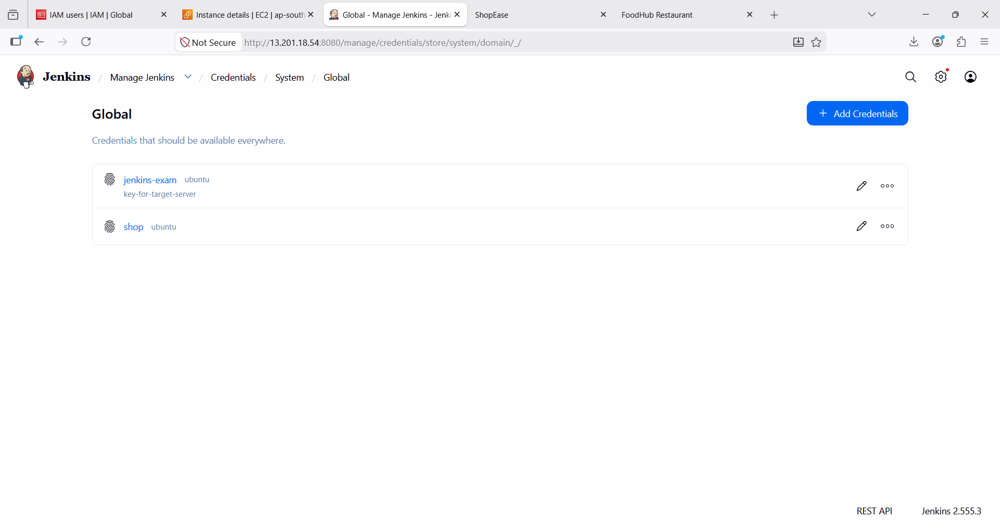
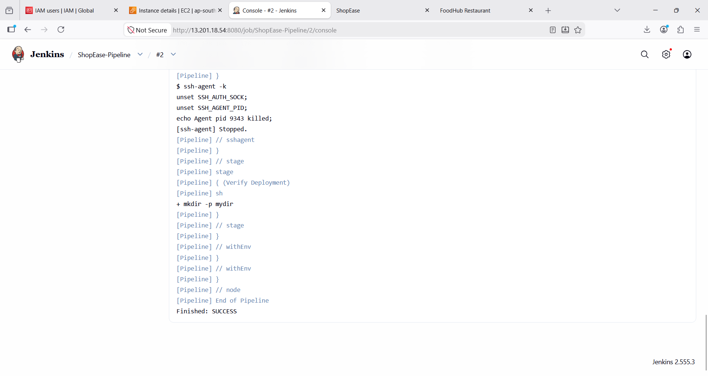
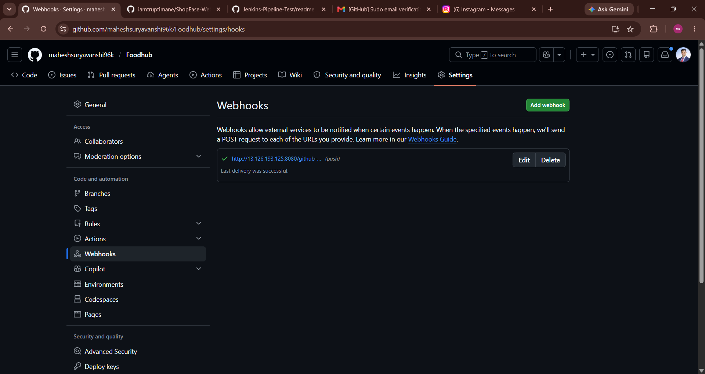
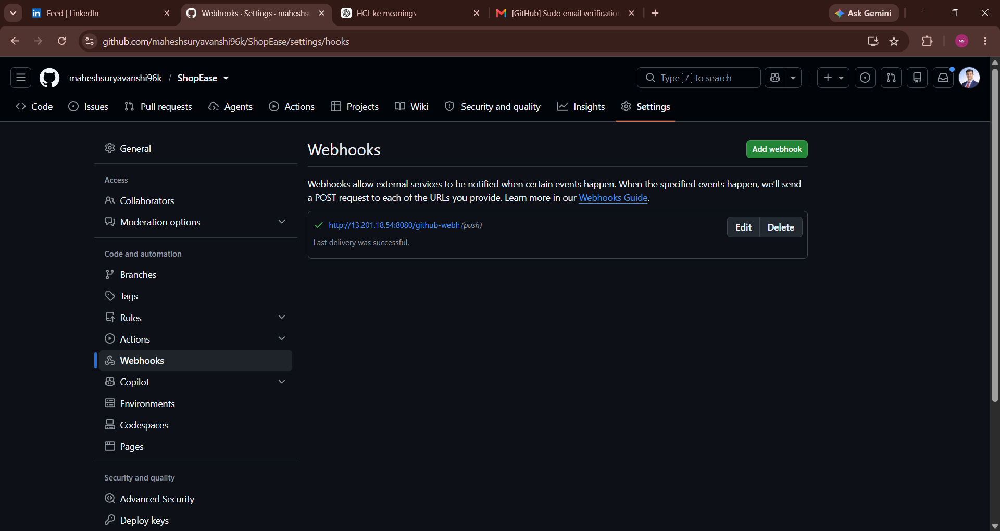
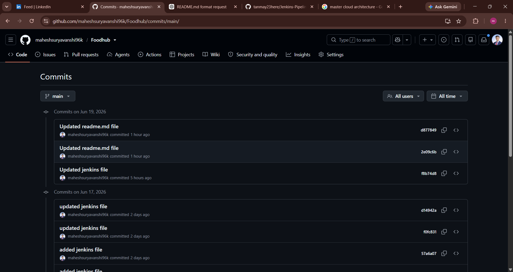
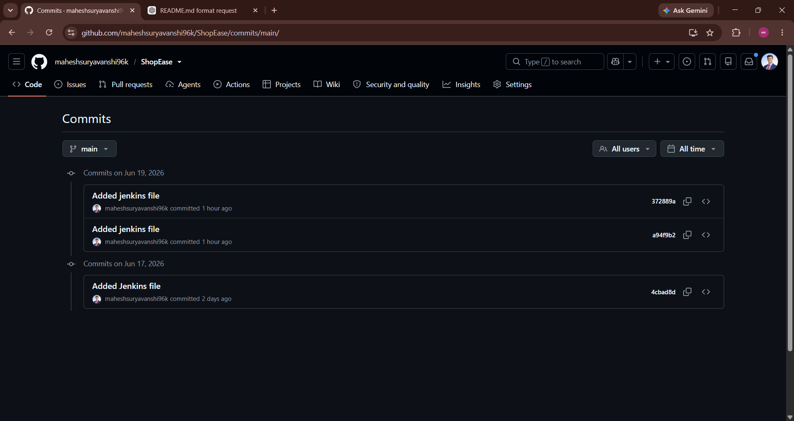
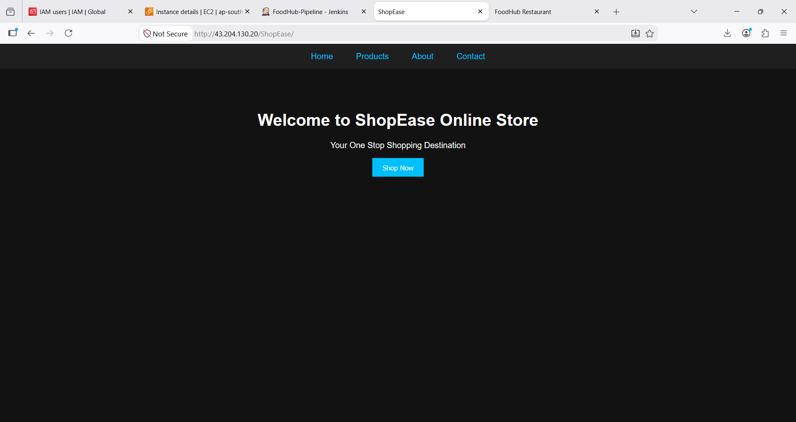

# 🚀 Jenkins CI/CD Assignment – FoodHub & ShopEase Deployment

|            |                                    |
| ---------- | ---------------------------------- |
| Name       | Mahesh Suryavanshi                 |
| Course     | Master Of Cloud Architecture       |
| Project    | Jenkins CI/CD Automation           |
| Tools Used | Jenkins, GitHub, Nginx, Linux, SSH |

> **Goal:** Deploy FoodHub and ShopEase websites automatically using Jenkins CI/CD pipelines and automate deployments on a Linux server using GitHub Webhooks.

---

# Part A – MCQ Answers

### 1. What is Jenkins mainly used for?

✅ **Answer:** B) Continuous Integration and Continuous Delivery

### 2. Which type of job allows you to define build steps using code in Jenkins?

✅ **Answer:** B) Pipeline Project

### 3. Which file is used to define a pipeline in Jenkins?

✅ **Answer:** C) Jenkinsfile

### 4. What is the purpose of a Jenkins Agent (Node)?

✅ **Answer:** B) To execute jobs assigned by the Jenkins controller

### 5. Which plugin is required to connect Jenkins with GitHub?

✅ **Answer:** B) Git Plugin

### 6. What is the purpose of a Webhook in Jenkins CI/CD?

✅ **Answer:** B) To trigger build automatically on code push

### 7. Which command is used inside Jenkins Pipeline to execute shell commands?

✅ **Answer:** C) sh

### 8. What is the purpose of `post` block in Jenkins Pipeline?

✅ **Answer:** B) Execute steps after pipeline stages

### 9. What is the use of `sshagent` in Jenkins Pipeline?

✅ **Answer:** C) Use stored SSH credentials during execution

### 10. What happens if a stage fails in Jenkins Pipeline (by default)?

✅ **Answer:** B) The pipeline stops execution

---

# Part B – Jenkins CI/CD Practical Test

## Scenario

The development team has already created two static websites and stored their code in GitHub repositories. The task is to set up CI/CD pipelines using Jenkins and automatically deploy both applications on the same target server.

---

# Task 1 – Infrastructure Setup

## Jenkins Server Setup

### Installed Java

```bash
sudo apt update && sudo apt upgrade -y
sudo apt install fontconfig openjdk-21-jre -y
```

### Added Jenkins Repository & Installed Jenkins

```bash
curl -fsSL https://pkg.jenkins.io/debian-stable/jenkins.io-2023.key | sudo tee \
/usr/share/keyrings/jenkins-keyring.asc > /dev/null

echo deb [signed-by=/usr/share/keyrings/jenkins-keyring.asc] \
https://pkg.jenkins.io/debian-stable binary/ | sudo tee \
/etc/apt/sources.list.d/jenkins.list > /dev/null

sudo apt update
sudo apt install jenkins -y
```

### Started Jenkins

```bash
sudo systemctl enable jenkins
sudo systemctl start jenkins
sudo systemctl status jenkins
```

### Installed Plugins

* Git Plugin
* Pipeline Plugin
* SSH Agent Plugin
* GitHub Plugin

### Configured SSH Credentials

```text
Manage Jenkins
→ Credentials
→ System
→ Global Credentials
→ Add Credentials

Kind: SSH Username with private key
ID: my-ssh-key
Username: ubuntu
Private Key: Paste PEM Key
```

### Screenshot

```md

```

---

## Target Server Setup

### Install Nginx

```bash
sudo apt update
sudo apt install nginx -y
sudo systemctl enable nginx
sudo systemctl start nginx
```

### Create Directories

```bash
sudo mkdir -p /var/www/html/foodhub
sudo mkdir -p /var/www/html/shopease
```

### Open Ports

```text
22 → SSH
80 → HTTP
8080 → Jenkins
```

### Screenshot

```md

```

---

# Task 2 – Application Repositories

## FoodHub Website

Repository:

```text
https://github.com/maheshsuryavanshi96k/Foodhub.git
```

Deploy Path:

```text
/var/www/html/Foodhub
```

Access URL:

```text
http://SERVER-IP/Foodhub
```

---

## ShopEase Website

Repository:

```text
https://github.com/maheshsuryavanshi96k/ShopEase.git
```

Deploy Path:

```text
/var/www/html/ShopEase
```

Access URL:

```text
http://SERVER-IP/ShopEase
```

---

# Task 3 – Jenkins Pipeline Jobs

## FoodHub Pipeline

```groovy
pipeline {
    agent any

    environment {
        SSH_CRED = 'jenkins-exam'
        TARGET_HOST_IP = '172.31.11.240'
        USER = 'ubuntu'
        REPO_URL = 'https://github.com/maheshsuryavanshi96k/Foodhub.git'
        BRANCH = 'main'
        DEPLOY_DIR = '/home/ubuntu/Foodhub'
    }

    stages {

        stage('Git Clone') {
            steps {
                git branch: "${BRANCH}", url: "${REPO_URL}"
            }
        }

        stage('Deploy to Target Host') {
            steps {
                sshagent(credentials: ['jenkins-exam']) {
                    sh """
                        ssh -o StrictHostKeyChecking=no ${USER}@${TARGET_HOST_IP} 'mkdir -p ${DEPLOY_DIR}'
                        scp -o StrictHostKeyChecking=no -r * ${USER}@${TARGET_HOST_IP}:${DEPLOY_DIR}
                    """
                }
            }
        }

        stage('Install & Configure Nginx') {
            steps {
                sshagent(credentials: ['jenkins-exam']) {
                    sh """
                        ssh -o StrictHostKeyChecking=no ${USER}@${TARGET_HOST_IP} '
                        sudo apt update &&
                        sudo apt install nginx -y &&
                        sudo systemctl enable nginx &&
                        sudo systemctl restart nginx &&
                        sudo rm -rf /var/www/html/* &&
                        sudo cp -r /home/ubuntu/Foodhub /var/www/html/ &&
                        sudo curl http://localhost:80/Foodhub
                        '
                    """
                }
            }
        }

        stage('Verify Deployment') {
            steps {
                sh """
                   mkdir -p mydir
                """
            }
        }
    }
}
```

### Screenshots

```md


```

---

## ShopEase Pipeline

```groovy
pipeline {
    agent any

    environment {
        SSH_CRED = 'shop'
        TARGET_HOST_IP = '172.31.11.240'
        USER = 'ubuntu'
        REPO_URL = 'https://github.com/maheshsuryavanshi96k/ShopEase.git'
        BRANCH = 'main'
        DEPLOY_DIR = '/home/ubuntu/ShopEase'
    }

    stages {

        stage('Git Clone') {
            steps {
                git branch: "${BRANCH}", url: "${REPO_URL}"
            }
        }

        stage('Deploy to Target Host') {
            steps {
                sshagent(credentials: ['shop']) {
                    sh """
                        ssh -o StrictHostKeyChecking=no ${USER}@${TARGET_HOST_IP} 'mkdir -p ${DEPLOY_DIR}'
                        scp -o StrictHostKeyChecking=no -r * ${USER}@${TARGET_HOST_IP}:${DEPLOY_DIR}
                    """
                }
            }
        }

        stage('Install & Configure Nginx') {
            steps {
                sshagent(credentials: ['shop']) {
                    sh """
                        ssh -o StrictHostKeyChecking=no ${USER}@${TARGET_HOST_IP} '
                        sudo apt update &&
                        sudo apt install nginx -y &&
                        sudo systemctl enable nginx &&
                       
                        sudo rm -rf /var/www/html/* &&
                        sudo cp -r /home/ubuntu/ShopEase /var/www/html/ &&
                         sudo systemctl restart nginx &&
                        sudo curl http://localhost:80/ShopEase
                        '
                    """
                }
            }
        }

        stage('Verify Deployment') {
            steps {
                sh """
                   mkdir -p mydir
                """
            }
        }
    }
}
```

### Screenshots

```md



```

---

# Task 4 – GitHub Webhook Configuration

Payload URL:

```text
http://13.201.18.54:8080/github-webhook/
```

Content Type:

```text
application/json
```

Event:

```text
Just the push event
```

Enable:

```text
GitHub hook trigger for GITScm polling
```

### Screenshots

```md

```

```md

```

---

# Task 5 – Website Modifications

## FoodHub Website

Before:

```text
Fresh Food Everyday
```

After:

```text
Delicious Food Delivered Fast
```

```bash
git add .
git commit -m "Updated homepage"
git push origin main
```

### Screenshots

```md



```

---

## ShopEase Website

Before:

```text
Welcome to ShopEase
```

After:

```text
Welcome to ShopEase Online Store
```

```bash
git add .
git commit -m "Updated homepage"
git push origin main
```

### Screenshots

```md



```

---

# Task 6 – Troubleshooting

| Issue                  | Resolution                  |
| ---------------------- | --------------------------- |
| Permission Denied      | Correct SSH Key Added       |
| Jenkins Build Failed   | Fixed Pipeline Syntax       |
| Nginx Not Serving Site | Restarted Nginx             |
| Webhook Not Triggering | Enabled GitHub Hook Trigger |

---

# CI/CD Architecture

```text
Developer
    │
    ▼
GitHub Repository
    │
    ▼
GitHub Webhook
    │
    ▼
Jenkins Server
    │
SSH / SCP
    │
    ▼
Target Server (Nginx)
    ├── FoodHub
    └── ShopEase
```

---

# Project Outcome

✅ Jenkins Installation

✅ GitHub Integration

✅ SSH Authentication

✅ Jenkins Pipelines

✅ Automated Deployment

✅ Nginx Configuration

✅ GitHub Webhooks

✅ CI/CD Automation

---

# Learning Outcomes

* Continuous Integration (CI)
* Continuous Delivery (CD)
* Jenkins Administration
* Jenkins Pipelines
* GitHub Webhooks
* SSH Authentication
* Nginx Configuration
* Automated Deployment
* DevOps Troubleshooting
p

